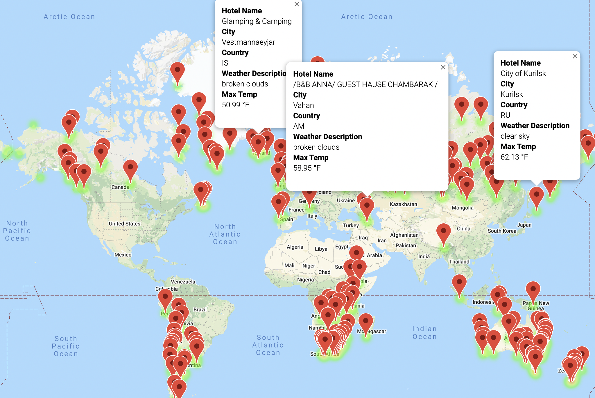
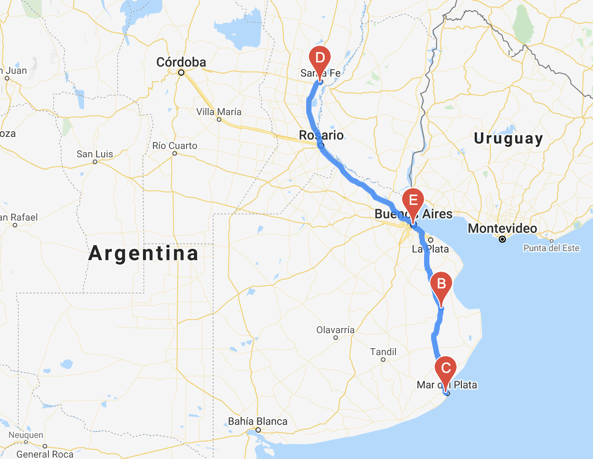
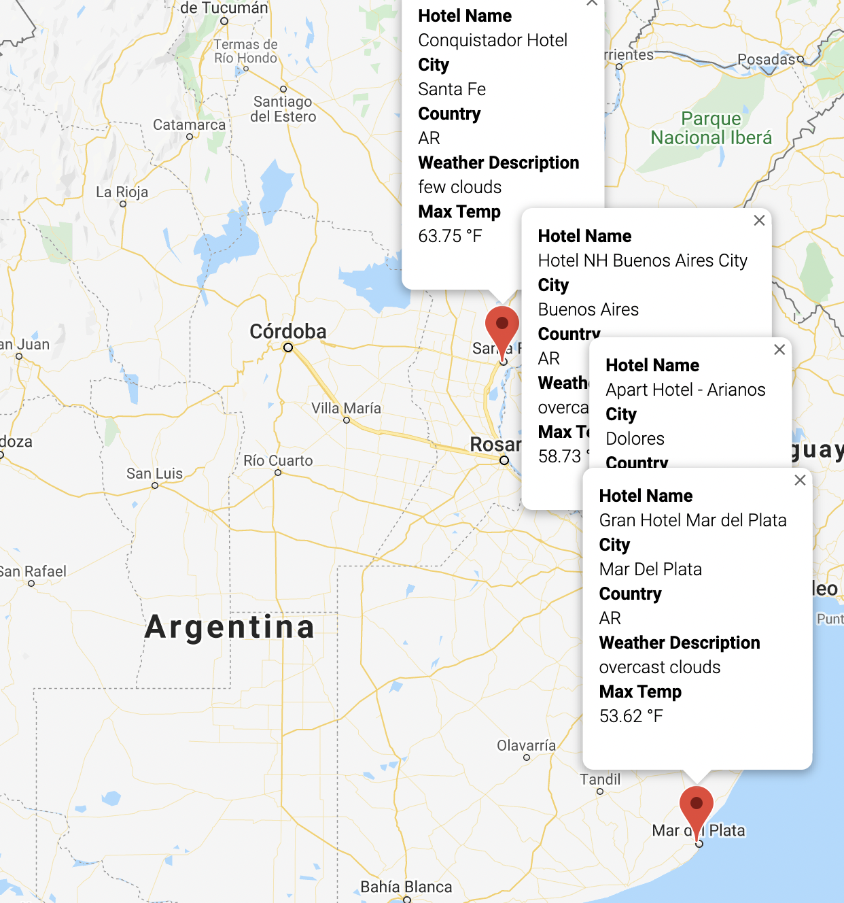

# World Weather Analysis

The purpose of this project was to create code for a program that allows users to input statements around preferred min and max temperatures for an upcoming vacation and receive an output of relevant locations. Then, the program recommends hotels and destinations within a country from the relevant location list. 

## APIs Used 
- In order to write the code, the World Weather App API was used to get current weather data from a set of cities.
- The Google Maps API was used to generate a map marking relevant locations based on the temperature inputs
- The Google Maps Directions API was used to generate a map with directions connecting the different stops on the itinerary

## Example image outputs 

### 1. Map of all cities within the min and max temperature inputs

  
  
### 2. Map of directions for all cities on the vacation itinerary

  

### 3. Location information for all cities on the vacation itinerary
  
